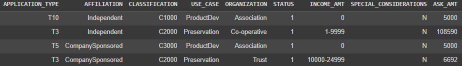
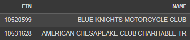

# Module21-Challenge-DeepLearning

Data Analytics Boot Camp - Module 21 - Neural Networks and Deep Learning \
Deep Learning Challenge

---

# 'Funding Applications' Analysis Report

## Overview of the Analysis

 This analysis reviewed a dataset of historical applications for funding from the 'Alphabet Soup' nonprofit organisation. The goal of the analysis was to review the dataset and apply machine learning and neural network techniques, to create a classification model that can predict whether applicants' ventures will be successful if funded by Alphabet Soup.

 The dataset consisted of a relatively even mix of successful and unsuccessful ventures:
 - Successful: 18,261 (53.2%) 34299
 - Unsuccessful: 16,038 (46.8%)

 The dataset content describes the historical applications in terms of the following aspects:
- EIN and NAME—Identification columns
- APPLICATION_TYPE—Alphabet Soup application type
- AFFILIATION—Affiliated sector of industry
- CLASSIFICATION—Government organisation classification
- USE_CASE—Use case for funding
- ORGANIZATION—Organisation type
- STATUS—Active status
- INCOME_AMT—Income classification
- SPECIAL_CONSIDERATIONS—Special considerations for application
- ASK_AMT—Funding amount requested
- IS_SUCCESSFUL—Was the money used effectively

# Results

## Data Preprocessing

What variable(s) are the target(s) of the model?
- The model's target is to predict IS_SUCCESSFUL (which takes values of 0 or 1, meaning unsuccessful or successful, respectively).

What variable(s) are the features of the model?

- The following variables were used to provide the model's features: APPLICATION_TYPE, AFFILIATION, CLASSIFICATION, USE_CASE, ORGANIZATION, STATUS, INCOME_AMT, SPECIAL_CONSIDERATIONS, ASK_AMT

What variable(s) should be removed from the input data because they are neither targets nor features?
- The EIN and NAME variables were dropped from consideration as they were organisation-specific and so would not provide information for a general prediction.

## Compiling, Training, and Evaluating the Model

How many neurons, layers, and activation functions did you select for the neural network model, and why?
- For the initial model (``AlphabetSoupCharity.ipynb``), the choices were:
    - 2 hidden layers with
        - 80 neurons, and
        - 30 neurons respectively, and
    - 1 output layer with
        - 1 neuron.
- The number of neurons in the first hidden layer was chosen to total approximately double the number of input features from the model (after categorical features were converted to numeric equivalents via encoding).
- The number of neurons in the second hidden layer was set to about two-thirds the number of the inputs to that layer. This is one possible general guideline for choosing neurons in subsequent hidden layers.
- Similarly, two hidden layers are deemed capable of representing an arbitrary decision boundary between input variables (refer to References below for more details).
- The 'ReLU' (Rectified Linearu Unit) activation function was chosen as one of the more is computationally efficient options available.

Was the target model performance (predictive accuracy higher than 75%) achieved?
- No.
- The available dataset was split into two subsets used for training and testing the model, respectively. When evaluated using the testing dataset (which represented 25% of the original dataset), the:
    - initial Deep Learning model (``AlphabetSoupCharity.ipynb``) achieved 72.9% accuracy
    - subsequent attempts to optimise the model (``AlphabetSoupCharity_Optimisation.ipynb``) achieved similar results (72.9%, 72.9%, and 73.0% accuracy).

What steps were taken to attempt to increase model performance?
- 

## Results Summary & Recommendation

### Summary

The 'AlphabetSoupCharity' Deep Learning model achieved approximately 73% accuracy, which was less than the target model performance of 75% accuracy.

# References

The following references were used in the development of the solution for this Challenge.

## Keras
- Activation functions https://keras.io/api/layers/activations/

## Neural Networks and Deep Learning
- How to determine the number of layers and neurons in hidden layers? https://medium.com/geekculture/introduction-to-neural-network-2f8b8221fbd3
- What is the relationship between the accuracy and the loss in deep learning? https://datascience.stackexchange.com/questions/42599/what-is-the-relationship-between-the-accuracy-and-the-loss-in-deep-learning
- Class notes/student activity files for 'Neural Networks and Deep Learning', Monash University 'Data Analytics Boot Camp', including Jupyter Notebooks, were used as references and implementation guides.